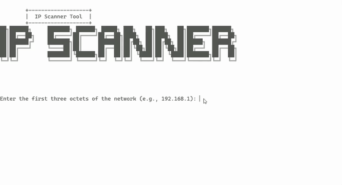
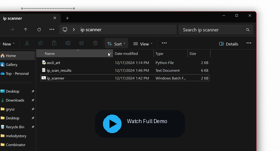

# IP Scanner

IP Scanner is a Windows batch-based network utility for quickly scanning a local IP range and writing the results to a report file.

It is designed for simple LAN troubleshooting and visibility, not stealth scanning or deep network enumeration.

## Demo



[](https://github.com/user-attachments/assets/6f44bfbb-f107-448d-80ae-f09952c9a99e)

If GitHub mobile only shows the video as a link, tap the preview card above to open the full demo clip directly.

## What It Does

For each IP in the range you provide, the script:
- sends a ping request
- attempts hostname resolution
- checks the local ARP table for a MAC address
- appends a local `netstat` listening snapshot
- appends local network interface details from `ipconfig`
- runs `tracert`
- writes everything into `ip_scan_results.txt`

## Repo Contents

- `ip_scanner.bat` - main scanner workflow
- `ascii_art.py` - startup banner displayed before the scan begins
- `ipscannerv1.exe` - packaged executable build

## Platform Requirements

- Windows
- Command Prompt
- Python 3.x available in `PATH`

Python is required because the batch script calls `ascii_art.py` before starting the scan.

## Quick Start

```bash
git clone https://github.com/gryszzz/IP_scanner.git
cd IP_scanner
```

Run the scanner:

```bat
ip_scanner.bat
```

You will be prompted for:
- the first three octets of the network, such as `10.0.0`
- the starting host octet
- the ending host octet

Example input:

```text
Network prefix: 10.0.0
Start host: 1
End host: 25
```

## Output

Results are written to:

```text
ip_scan_results.txt
```

The report includes the scan timestamp and the collected output for each target address.

## Important Behavior Notes

- This project is best suited for small internal network checks.
- The `netstat -an | findstr "LISTENING"` output reflects listening ports on the local machine running the script, not verified open ports on each remote host.
- MAC address discovery depends on whether the target appears in the local ARP cache.
- Hostname resolution depends on what `ping -a` can resolve in your environment.
- `tracert` can make larger scans take noticeably longer.

## Suggested Use Cases

- quick LAN diagnostics
- checking host reachability across a subnet slice
- generating a rough network activity report for troubleshooting
- collecting basic command-line evidence before deeper analysis

## License

No license file is currently included in this repository. Add one if you want to make reuse terms explicit.
